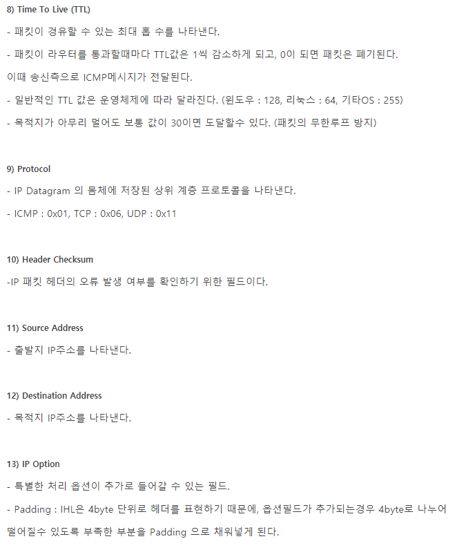

### 1. OSI 7계층

1. OSI 7계층 모델: 네트워크에서 통신이 일어나는 과정을 7단계로 나눈 모델. 계층을 나눔으로써 통신이 일어나는 과정을 단계별로 파악할 수 있어 한눈에 알아보기 쉽고 특정한 단계에 이상이 생기면 다른 단계를 건들이지 않고 해당 단계만 고치는 데 용이하다.
    1. 제 1계층(Physical Layer): 물리계층으로 시스템의 전기적, 물리적 표현을 나타낸다. 케이블의 종류, 무선 주파수 링크는 물론 전압, 핀매치 등의 물리 요건 등이 포함된다. 물리계층에서의 문제는 케이블이 제대로 연결되어 있는지 라우터나 스위치 또는 컴퓨터에서 전원 플러그가 빠지지 않았는지 확인한다. 통신 단위는 비트. 장비는 통신케이블, 리피트, 허브
    2. 제 2계층(Data Link Layer): 데이터링크 계층은 두개의 직접 연결된 노드 사이의 데이터 전송을 제공하며 물리 계층의 오류 수정 및 재전송 기능을 가지고 있다. 여기에는 2개의 부계층도 존재하는데 하나는 MAC계층이고 다른 하나는 논리적 연결 제어(LLC) 계층이다. 장비는 브릿지와 스위치가 있다.
    3.  제 3계층(Network Layer): 네트워크 계층에서는 데이터를 상대가 있는 곳까지 전달하기 위한 경로 선택이나 네트워크에서 각각을 식별하기 위한 주소를 관리하는 라우팅 기능을 제공한다. 대표적인 장비는 라우터이다.
    4.  제 4계층(Transport Layer): 전송계층에서는 네트워크 계층에서 보내져 온 데이터의 정렬과 오류 정정 등을 수행하고 송수신된 데이터의 신뢰성을 확보합니다. 
    5.  제 5계층(Session Layer): 세션계층에서는 통신의 시작과 종료와 같은 통신 프로토콜 간의 연결을 관리하고, 통신 경로를 확립합니다. 
    6. 제 6계층(Presentation Layer): 표현계층에서는 압축 방법이나 문자코드를 관리하고 애플리케이션과 네트워크와의 중개를 수행한다. 
    7. 제 7계층(Application Layer): 응용 계층에서는 통신을 이용하기위한 서비스를 사람과 다른 컴퓨터에 제공합니다.
2. 네트워크 프로토콜: 네트워크를 통해 컴퓨터 간에 정보를 주고받는 절차와 약속
3. IP: 제 3계층인 네트워크 계층에 위치하는 네트워크 프로토콜로 네트워크 상의 기기에 대한 주소 할당이나 그 주소를 바탕으로 패킷을 전송하는 역할을 갖고 있다. ip주소는 ip기반으로 하는 네트워크에서 한 대의 컴퓨터마다 할당되어 있는 식별번호로 32비트 수치로 표현한다. ip주소의 내용은 네트워크 별로 나뉘는 네트워크 주소부와 네트워크 안에서 컴퓨터를 식별하기 위한 호스트 주소부가 조합되어 구성되어 있다.
4. TCP: 제 4계층인 전송 계층에 위치하는 네트워크 프로토콜로, 데이터의 결손이 없애고 상대방에게 확실히 전달되도록 하는 역할을 갖고 있다. tcp에서는 제 5계층 이상의 프로토콜로부터 통신 데이터를 받아 이를 패킷으로 분할합니다. 그리고 그 패킷을 제3계층인 IP에게 전달하여 상대방에게 전달되도록합니다. 그런데 ip에서는 패킷이 순서대로 전달되는 것을 보증하지 않는다. 그래서 tcp에서는  통신 데이터를 패킷으로 분할할 때 시퀀스 번호를 붙여두고, 수신 측에서 이 번호를 체크하여 필요하면 정렬을 하여 패킷의 순서가 올바르게 되도록 보증한다. 또한 수신 측에서는 반드시 수신했다는 것을 나타내는 통지패킷(ACK 패킷)을 송신 측에 돌려보냅니다.이로써 송신측에서는 송출한 패킷이 전달되었는지 아닌지를 판단할 수 있으며, 일정 시간을 기다려도 답이 오지 않는 경우에는 패킷을 재송출함으로써 결손을 막는 구조로 되어 있습니다. 
5. 패킷 구조
    1. 전체 패킷 구조 
    2. 이더넷 헤더 
    3. IP 헤더     
    4. TCP 헤더  
    5. UDP 헤더 
6. 패킷: 큰 데이터를 분할하지 않고 네트워크상으로 흘려보내면 그 데이터가 회선을 모두 점유해 버려서 다른 기기가 전혀 통신할 수 없게 되는 문제가 발생합니다. 그렇게 때문에 통신 데이터를 패킷이라는 단위로 작게 분할하여 회선을 공유할 수 있도록 하는 것이다. 패킷에 추가되는 정보에는 해당 패킷이 사용하는 네트워크 프로토콜에 관한 정보도 기재되어 있다. 이로써 동일 네트워크 회선 상에서도 여러 개의 네트워크 프로토콜을 섞어서 이용할 수 있다.
7. 서브넷 마스크: 네트워크가 대규모가 되면 단일 네트워크로서 관리하기가 어려워진다. 특히 브로드캐스트 패킷으로 인한 네트워크 효율악화를 막을 수 있다. 이를 막기 위해선 사무소나 사업부와 같은 단위로 네트워크를 논리적으로 분할해야한다. IP주소는 네트워크를 식별하기 위한 네트워크 주소부와 그 네트워크 상의 컴퓨터를 식별하기 위한 호스트 주소부로 나눌 수 있다. 서브넷 마스크를 사용하면 이 호스트 주소 부분의 몇 비트를 네트워크 주소부로 다시 정의함으로써 단일 네트워크 아래를 서브넷으로 구분할 수 있다. 예를들어 172.16.0.0~172.16.255.255라는 범위의 ip주소를 사용하는 네트워크의 경우, 상위 16비트까지가 네트워크 주소부에 해당한다. 이에대해 255.255.255.0으로 서브넷 마스크를 지정하면 상위 24비트까지를 네트워크 주소로서 정의할 수 있습니다. 이로써 172.16 아래의 네트워크는 172.16.0~172.16.255라는 255개의 서브넷으로 나눌 수 있다. 
8. 포트번호: 네트워크 통신을 위한 프로그램 별 연결위치를 나타내는 번호
9. 소켓: 두 애플리케이션이 네트워크를 통해 서로 통신할 수 있도록 소프트웨어로 작성된 추상적 개념의 통신 접속점. 두 소켓이 연결되면 프로세스끼리 데이터를 전달할 수 있다. 소켓으로인해 네트워크 및 전송 계층의 캡슐화가 되었다. 
10. 전송과정: 하나의 어플리케이션이 전송을 하면 소켓을 통해 tcp/ip 계층 프로그램으로 보내게되면 tcp/ip계층에서 데이터를 잘게 쪼개고 그에 대한 순서와 신뢰성을 위한 ack나 syn을 flag를 붙여서 ip계층으로 보내면 이것을 어디로 보낼지에 대한 정보를 헤더에 붙이고 데이터링크, 피지컬 레이어를 이용해 보내게 된다. 도착한 패킷은 네트워크계층에서 어디서 왔는지를 확인하고 t계층에서 순서를 조합하거나 제대로 도착하지 못한건 다시 요청을 하게 된다. 그리고 해당 소켓을 통해 목적지 어플리케이션에 도달하게 된다.

---
### 2. 로컬 영역 네트워크 및 와이드 영역 네트워크
6. WWW(World Wide Web):  **WWW란 인터넷에서 표준적으로 사용되는 문서 시스템**으로 하나의 문서 안에 그림이나 음성 등 다양한 콘텐츠를 끼워 넣을 수 있으며, 문서 간에 링크를 설정함으로써 문서들을 서로 연결시킬 수 있는 것이 특징이다. www 문서는 인터넷의 웹서버에 대해 웹 브라우저라는 애플리케이션을 사용하여 액세스함으로써 표시할 수 있다. 
7. VPN(Virtual Private Network): 인터넷에 가상의 전용선 공간을 만들어 놓음으로써 거점 간에 암호화된 통신 데이터를 주고받음으로써 실현된다.
16. Ethernet(이더넷): **미국 Xerox사에서 발명한 대표적인 LAN 네트워크 모델**으로 이더넷에서는 네트워크 상의 통신 상황을 감시하여 통신을 하는 사람이 없는 경우에 한해 데이터 송신을 시작하는 캐리어 센스라는 장치와 그래도 동시에 송신을 해버리는 경우에 발생하는 충돌을 검출하는 장치를 사용하여 통신을 제어한다. 이 제어 방식을 CSMA/CD(Carrier Sense Multiple Access/Collision Detection) 방식이라고 부른다. 
17. Token Ring(토큰 링): **IBM사에 의해 제창된 네트워크 모델**으로 통신제어를 토큰 패키징 방식을 사용하는데 토큰 패키징 방식이란 네트워크 상에 통신 권리를 나타내는 토큰 이라는 이름의 데이터를 흘려보내는 방식으로, Token에 의해 송수신 관리를 하는 것이다. 보통 네트워크 송신 데이터가 하나도 없을 때에는 이 Token이 단독으로 흐르고 있다. 각 컴퓨터는 Token을 수신하여 거기에 아무 데이터가 존재하지 않으면 그대로 다음 컴퓨터로 흘려보낸다. 이와 같이 한 방향을 향해 Token만이 양동이 릴레이와 같이 전달되어 가는 것이 부하가 없을 때의 상태입니다. 송신하고 싶은 데이터가 발생한 컴퓨터는 이 Token이 수중에 들어오는 것을 기다렸다가 Token을 잡으면 그 뒤에 송신 데이터를 붙여서 다시 양동이 릴레이를 계속합니다. 그 다음에 Token을 받은 컴퓨터는 그 데이터가 자기 앞으로 온 것인지를 체크하고 자기 앞으로 온 것이 아니면 그대로 다음 컴퓨터에게 전달하고, 자기 앞으로 온 경우에는 데이터를 꺼내고 Token만을 다시 보내게 됩니다. 
18. 프라이빗 ip: 전 세계의 컴퓨터가 연결되는 네트워크에서 개별적으로 32비트 ip주소를 할당하는 것은 현실적으로 어렵다. 그래서 LAN과 같이 한정된 좁은 범위에서는 프라이빗 ip주소를 할당한다. 
19. ISDN(Integrated Services Digital Network): ISDN은 종합 디지털 통신망의 약자로 전화나 FAX, 데이터 통신을 통합하여 취급할 수 있는 디지털 통신망을 가리킨다. 국제 표준 규격으로 정해져 있으며, 지금은 다른 것을 사용한다.

---
### 3. 프로토콜과 서비스 프로토콜
1. http(hypertext transfer protocol): www 서비스에서 서버와 정보를 주고받을 때 사용하는 프로토콜 :80
2. smtp(simple mail transfer protocol): 인터넷 메일의 송신에 사용되는 프로토콜 :25
3. pop(post office protocol): 인터넷 메일의 수신에 사용하는 프로토콜. 수신 메일을 다운로드 하기 위한 프로토콜 :110
4. Imap(internet message access protocol):수신한 인터넷 메일을 서버로부터 취득하기 위한 프로토콜. 수신한 전자메일을 포함한 모든 송수신 데이터를 서버에서 관리한다. imap을 지원하는 전자 메일 소프트웨어만 있으면 어떤 컴퓨터에서든 전자메일을 확인 송수신할 수 있다. :143
5. ftp(file transfer protocol): 서버와 클라이언트라는 2대의 컴퓨터 사이에서 파일 전송을 하기 위한 네트워크 프로토콜 :제어용 21, 전송용 20
6. ssl(secure sockers layer):  인터넷에서 정보를 안전하게 주고받기 위해 사용하는 암호화 프로토콜. ssl을 이용한 통신에는 네트워크에서 서로를 인증함으로써 '가장'을 막고 통신 데이터를 암호화함으로써 데이터의 도청이나 변조를 막는다. 인터넷의 온라인 쇼핑이나 결제같은것에 필요한 프로토콜이다.
7. https(hypertext transfer protocol over ssl): https란 www서비스에서 서버와 정보를 주고 받는 데 사용하는 http에 ssl을 사용한 암호화 통신을 추가한 프로토콜이다. 
8. ntp(network time protocol): 인터넷에서 표준으로 사용하는 시각 정보 프로토콜이다. 네트워크에 있는 컴퓨터의 시각을 동기화시키기 위해 사용합니다.
9. icmp(internet control message protocol): **tcp/ip 패킷 전송에서 발생한 각종 오류 정보를 보고하기 위해 이용하는 네트워크 프로토콜입니다.** 통신 중에 오류가 발생한 경우는 오류가 발생한 장소에서 패킷을 보낸 곳에 대해 icmp를 사용하여 오류 정보를 반송한다. 중간 경로의 기기는 이 보골르 보고 네트워크에 발생한 장애를 알 수 가 있는 것이다. icmp를 이용한 네트워크 검사 명령으로 유명한 것이 ping과 traceroute이다.
10. ping: 지정 컴퓨터까지 패킷이 도착하는 지를 시험함으로써 네트워크의 소통을 확인할 수 있다.
11. traceroute: 지정 컴퓨터에 도착할 대까지 어떤 경로를 거치고 있는지를 조사할 수 있다.
12. html: www용 문서를 기술하기 위해 사용하는 언어

